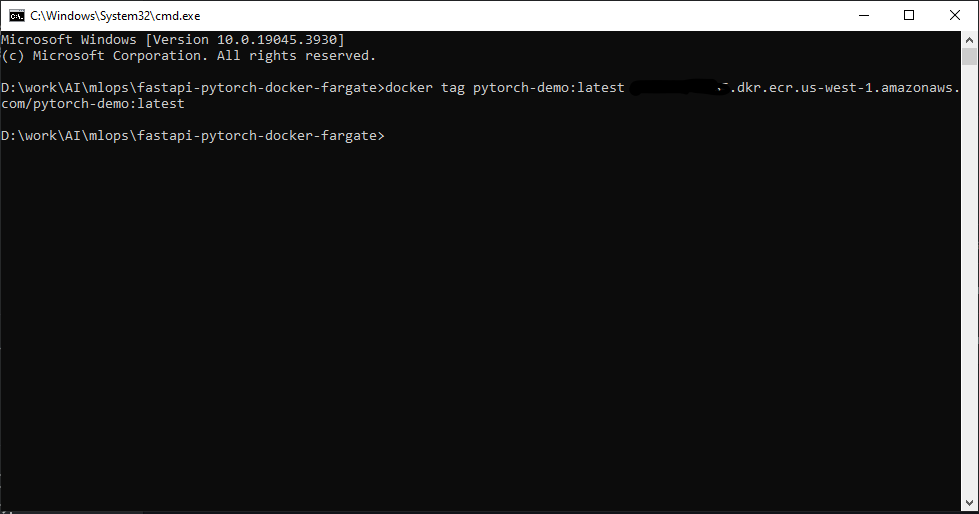
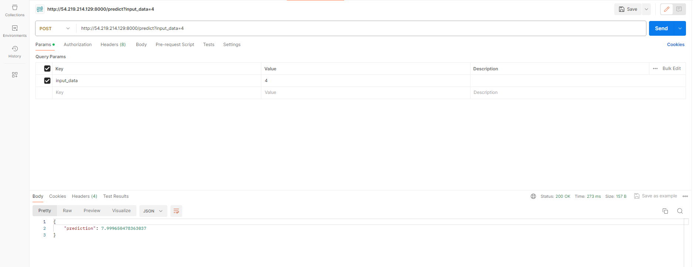

# FastAPI PyTorch Docker Fargate Demo
This is a demo project showcasing the use of FastAPI, PyTorch, Docker, and AWS Fargate for deploying a simple linear regression model.

## Model
The model used in this project is a simple linear regression model with the formula y = 2 * x.
https://drive.google.com/file/d/1IUCfL1uuWOn-MCixitZ0jmAfEEB5KiPV/view?usp=sharing
## Technologies Used
- PyTorch: Used for building and training the linear regression model.
- Docker: Used for containerization of the application.
- FastAPI: Used as the web server for serving the AI model.
- AWS Fargate: Used for deployment of the application.
## How to build DockerImage
- Install Docker
- In Destination folder run this command: `docker build -t docker_image_name .`
## Why whl file is included?
Unfortunately, installing Torch 2.2.0 with the requirements file failed.
This is because fastapi is supported in Python 3.8 and above, and docker couldn't find a stable version in the his environment.
## Deployment
The application is deployed using Amazon CloudFormation and AWS Fargate. The necessary configuration files for deployment are included in the repository.
- Build image

- Set up ECR

- Tag Image

- Log in

- Push Image

- Create Cluster

- Define Task

- Create Service

- Confirm the task is running

- Test the result

## Usage
To run the application locally, follow these steps:

### Clone the repository.
Build the Docker image using the provided Dockerfile.
Run the Docker container.
Access the FastAPI web server at http://localhost:8000.
### API Endpoints
/predict/{x}: Given an input x, the API endpoint will return the predicted output y using the trained linear regression model.
## Contributors

Feel free to contribute to this project by creating a pull request. If you have any questions or suggestions, please open an issue.
Please cantact if any issues. aitechguy0105@gmail.com
Thank you for checking out this demo project!